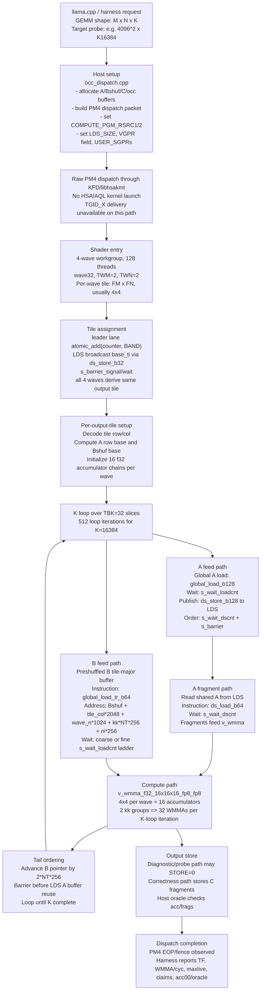
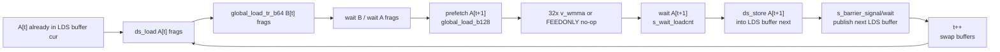
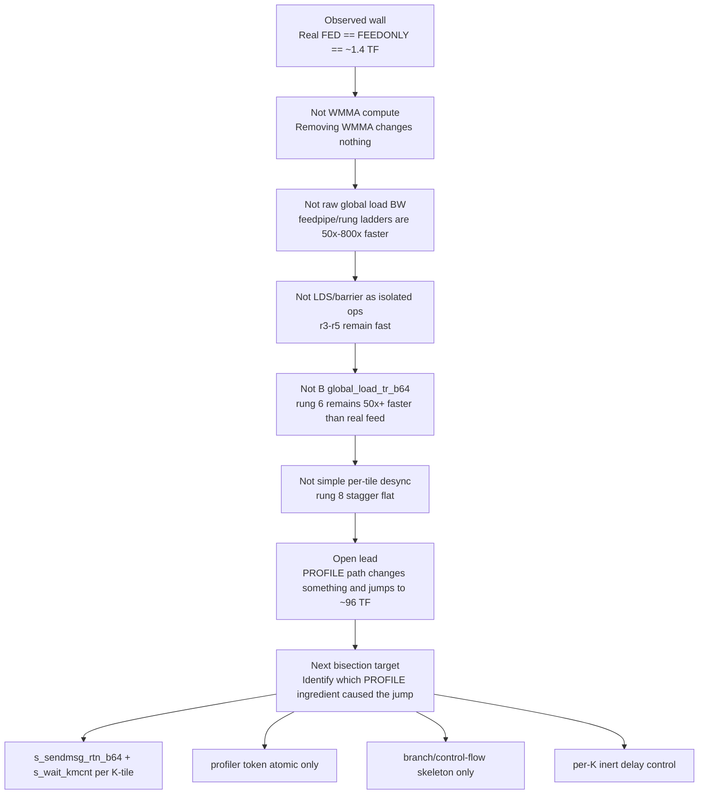

# RDNA4 Wave-Group fp8 GEMM Kernel Flow Diagram

**Date:** 2026-06-18  
**Target:** AMD Radeon AI PRO R9700 / gfx1201, RDNA4, wave32  
**Kernel under investigation:** `ggml/src/ggml-cuda/aiter-integration/rdna4_fp8_gemm/spike/dvgpr_occ/occ_kernel_wggemm2.s`

This diagram shows the current PM4 wave-group GEMM path from host request to completed output, plus the
measured probes that have ruled stages in or out as the dominant slowdown.

## End-to-End Flow

## Current Real-Kernel Hot Loop Shape

The slow fed path is the real `DBUF==1` A-ping-pong loop unless a probe selects another path.

Important: the real path remains slow even when the WMMA body is removed (`FEEDONLY`), so the current
wall is in loop sequencing or a hidden side effect, not in matrix arithmetic.

## Measurements Attached To Each Stage

| Stage / probe | What it tested | Result | Current reading |
|---|---|---:|---|
| HIP winner, fed | Reference 4-wave HIP kernel, same shape family | **161.1 TF** @ `4096^2 x K16384` | G2 parity bar |
| HIP winner, NOFEED | Same HIP lever kernel with feed removed | **272.0 TF** | Matrix stream can be dense when feed instructions are removed |
| PM4 real fed `DBUF==1` | Current 4-wave PM4 GEMM path | **~1.4 TF** | Broken for performance |
| PM4 real `FEEDONLY` | Same feed loop, WMMA removed | **~1.4 TF-equivalent** | WMMA is not on the critical path |
| PM4 real NOFEED | Load once, reuse operands, no per-K feed | **~104-107 TF** | Compute path is viable but below HIP NOFEED |
| 2x2 NOFEED | Higher occupancy, smaller tile | **32.8 TF** | Shrinking tile destroys issue density |
| KUNROLL NOFEED U=1..8 | Longer back-to-back WMMA run | **~100-105 TF flat** | Not backedge/run-length bound |
| Band claim sweep | Fewer atomics in real GEMM | NOFEED **107 -> 101** for band 1->4 | Atomic claim is secondary in real path |
| Feed-only depth-P probe | 1-wave, no LDS, no barrier, normal loads | P=1 **123 GB/s**, P=16 **48 GB/s** | Raw load stream is not the 2.7 GB/s wall |
| Coupling ladder r1-r5 | Add 4-wave WG, barriers, LDS A round-trip | **1073-2382 GB/s** synthetic | 4-wave shape, barrier cadence, LDS publication are individually fast |
| B transpose rung 6 | `global_load_tr_b64`, real Bshuf addressing, real residency | **137-274 GB/s** | B transpose load is not pathological |
| PROFILE rung 7 | Add sampled realtime timers to real loop | **~96 TF** anomaly | Profiler side effect makes slow real loop fast |
| STAGGER rung 8 | Inert per-WG delay before K loop | **~1.4 TF flat** | One-time per-tile stagger does not reproduce PROFILE speed-up |

## Current Investigation State

## Stage Glossary

| Term | Meaning in this kernel |
|---|---|
| Raw PM4 | Direct command submission through KFD/libhsakmt, bypassing normal HSA/AQL launch behavior |
| TGID_X | Hardware workgroup id. It is not delivered to SGPRs in this raw-PM4 path, so tile assignment uses an atomic queue |
| 4-wave workgroup | 128-thread workgroup, four wave32 waves cooperate on one logical 128x128 output tile |
| Atomic claim | Leader lane claims tile index `ti` with `global_atomic_add` |
| LDS broadcast | Leader writes `ti` or A tile data to LDS; other waves read after `s_barrier_signal/wait` |
| A feed | Global A rows loaded by `global_load_b128`, staged into LDS by `ds_store_b128`, then consumed by `ds_load_b64` fragments |
| B feed | Preshuffled B read directly with `global_load_tr_b64`; no fp8 `global_load_tr_b128` path exists |
| `s_wait_loadcnt` | Waits for outstanding global/vector memory loads tracked by loadcnt |
| `s_wait_dscnt` | Waits for LDS/DS operations tracked by dscnt |
| `v_wmma_f32_16x16x16_fp8_fp8` | RDNA4 fp8 WMMA instruction producing f32 accumulators |
| `DBUF==1` | Current default A ping-pong LDS path; this is the canonical slow fed path under investigation |
| `FEEDONLY` | Probe variant that preserves feed/waits/barriers but removes WMMA, proving compute is not on the critical path |
| `PROFILE` | Probe variant with sampled realtime timers; unexpectedly speeds the real loop to ~96 TF |

## Simplified Mental Model

The current evidence says individual hardware operations are fast when isolated. The slow behavior only
appears when they are composed in the real `DBUF==1` loop. The actionable anomaly is the `PROFILE`
variant: a small code-path perturbation changes the same real loop from ~1.4 TF to ~96 TF. The next
diagram update should replace the open `PROFILE` box with the specific side effect once bisection finds it.
