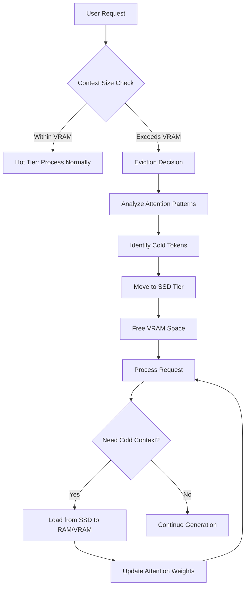

# Tiered KV Cache Implementation Plan

## Overview
Implement a tiered KV cache system that allows expanding context windows by utilizing VRAM, RAM, and SSD storage with intelligent eviction policies based on attention patterns and token recency.

## Target Configuration
- **Hot Tier (VRAM)**: 32-64k tokens - currently used context
- **Warm Tier (RAM)**: 32-64k tokens - recently used context
- **Cold Tier (SSD)**: 128k+ tokens - less frequently accessed context
- **Total Target**: 256k+ token context windows

## Architecture Overview



## Command-Line Interface

### New Flag: `--kv-tiered`
```
--kv-tiered VRAM%,RAM%,SSD%
```
- Takes comma-separated percentages that sum to 100%
- Applied to total `--ctx` value
- Example: `--kv-tiered 25,25,50` with `--ctx 256k` = 64k VRAM, 64k RAM, 128k SSD

### SSD Storage Format (int4/int8/quantized)
- **int4**: 4-bit quantized KV cache (4x space reduction, fast access)
- **int8**: 8-bit quantized KV cache (2x space reduction, faster access than int4)
- **quantized**: Model-native quantization (best compression, slightly slower)
- Default: `int4` for best space/speed balance
- **Recommended**: `int4` provides good balance - 4x compression with minimal access overhead

### Related Flags
```
--tier-eviction-policy [lru|lfu|attention|hybrid]
--tier-ssd-path PATH          # Directory for cold tier storage
--tier-compression [none|lz4|quantized]  # Optional compression for SSD
--tier-attention-threshold N   # Attention score threshold for eviction (0.0-1.0)
```

## Data Structures

### New Tier Manager Class
```cpp
// src/llama-kv-cache-tiered.h/cpp
class llama_kv_cache_tiered {
    // Hot tier: VRAM (llama_kv_cache)
    std::unique_ptr<llama_kv_cache> hot_tier;
    
    // Warm tier: RAM (compressed/quantized)
    std::unique_ptr<llama_kv_cache> warm_tier;
    
    // Cold tier: SSD (file-based)
    std::string cold_tier_path;
    
    // Eviction policy
    enum eviction_policy {
        LRU,
        LFU,
        ATTENTION,
        HYBRID  // Attention + recency
    };
    
    // Token metadata for eviction decisions
    struct token_metadata {
        llama_pos position;
        float attention_score;
        std::chrono::time_t last_access;
        uint32_t access_count;
    };
};
```

## Eviction Policy Implementation

### Hybrid Policy (Recommended Default)
```cpp
struct eviction_score {
    float attention_weight;    // 0.0-1.0, lower = less important
    float recency_weight;      // Based on time since last access
    float frequency_weight;    // Based on access frequency
    
    float calculate() {
        // Weighted combination
        return w_att * attention_weight + 
               w_rec * recency_weight + 
               w_freq * frequency_weight;
    }
};
```

### Attention-Based Eviction
- Track attention scores per token position
- Tokens with consistently low attention scores are candidates for eviction
- Context-aware: preserves tokens that participate in current attention patterns

## Implementation Phases

### Phase 1: Core Infrastructure
1. **Extend `llama_kv_cache` with tier awareness**
   - Add tier metadata to slot info
   - Modify `seq_cp`, `seq_rm` to handle tier boundaries
   
2. **Create tier manager**
   - `llama_kv_cache_tiered` class
   - Tier allocation based on percentages
   - Basic LRU eviction as fallback

3. **SSD storage format**
   - Binary format for speed
   - Per-layer KV pairs stored separately
   - Index file for quick lookup

### Phase 2: Smart Eviction
1. **Attention tracking**
   - Hook into attention computation
   - Accumulate attention scores per token
   - Periodic normalization

2. **Hybrid eviction policy**
   - Combine attention + recency + frequency
   - Configurable weights
   - Per-layer importance (some layers more critical)

3. **Migration optimization**
   - Batch migrations to reduce I/O
   - Prefetch likely-needed cold tokens
   - Background eviction thread

### Phase 3: Integration & Optimization
1. **Server integration**
   - Add flags to server argument parser
   - Per-slot tier management
   - Metrics endpoint for cache statistics

2. **Performance optimization**
   - Async SSD I/O
   - Compression for warm tier
   - Layer-adaptive quantization

3. **Testing & validation**
   - Benchmark with various context sizes
   - Validate attention-based eviction accuracy
   - Memory usage profiling

## Integration Points

### Existing Files to Modify
- [`tools/server/server-context.cpp`](tools/server/server-context.cpp) - Add tier flags
- [`tools/server/server-task.cpp`](tools/server/server-task.cpp) - Parse tier parameters
- [`src/llama-context.cpp`](src/llama-context.cpp) - Tier-aware context management
- [`src/llama-kv-cache.cpp`](src/llama-kv-cache.cpp) - Core tier infrastructure

### New Files to Create
- `src/llama-kv-cache-tiered.h/cpp` - Tier manager implementation
- `src/llama-eviction-policy.h/cpp` - Eviction policy algorithms
- `tools/server/tiered-cache.cpp` - Server integration

### vAttention Integration (Required Dependency)
The Microsoft vattention repository provides paged attention support. Repo located here: https://github.com/microsoft/vattention This will be a **required dependency** for the tiered cache system:
- Use vattention for hot tier management (paged attention in VRAM)
- Use vattention for warm tier management (paged attention in RAM)
- Cold tier uses file-based storage with vattention-compatible format
- Enables future features like cross-server KV cache sharing

## Configuration Examples

### Agent Use Case (256k context)
```bash
llama-server \
  --ctx 256k \
  --kv-tiered 25,25,50 \
  --tier-eviction-policy hybrid \
  --tier-ssd-path /ssd/cache \
  --tier-attention-threshold 0.1
```

### Single-Session High-Context (128k context)
```bash
llama-server \
  --ctx 128k \
  --kv-tiered 50,50,0 \
  --tier-eviction-policy lru
```

### Multi-Agent Server (512k+ context)
```bash
llama-server \
  --ctx 512k \
  --kv-tiered 12.5,12.5,75 \
  --tier-eviction-policy attention \
  --tier-ssd-path /nvme/cache \
  --cache-ram 64000  # 64GB RAM limit
```

## Metrics to Track
- `tier_hot_tokens`: Tokens currently in VRAM
- `tier_warm_tokens`: Tokens currently in RAM
- `tier_cold_tokens`: Tokens stored on SSD
- `eviction_count`: Number of tokens evicted
- `cache_hit_rate`: Percentage of requests served from cache
- `migration_latency`: Time to move tokens between tiers

## Risk Assessment
- **Low Risk**: LRU eviction (simple, predictable)
- **Medium Risk**: Attention-based eviction (requires validation)
- **High Risk**: Full hybrid with compression (complex, needs testing)

## Success Criteria
1. Can maintain 256k+ context with reasonable VRAM usage
2. Attention-based eviction preserves relevant context >90% of the time
3. Migration overhead <10% of total inference time
4. Multi-agent scenarios show measurable improvement over flat cache

## Summary from Session 1

## Summary of Tiered KV Cache Implementation

### Completed Work

**Phase 1: Core Infrastructure**
1. ✅ **Created `src/llama-eviction-policy.h`** - Defines eviction policy types (LRU, LFU, attention, hybrid), eviction score structure, and token metadata store with methods for tracking token access patterns and calculating eviction candidates.

2. ✅ **Created `src/llama-kv-cache-tiered.h/cpp`** - Defines the tiered cache class with:
   - Tier configuration (hot/warm/cold percentages)
   - SSD storage format with binary file format
   - Tier statistics tracking
   - Basic eviction and migration interfaces

3. ✅ **Modified `common/common.h`** - Added tier-related fields to `common_params`:
   - `kv_tiered_enabled`
   - `kv_tier_hot_pct`, `kv_tier_warm_pct`, `kv_tier_cold_pct`
   - `kv_tier_ssd_path`
   - `kv_tier_eviction_policy`
   - `kv_tier_compression`
   - `kv_tier_attention_threshold`

4. ✅ **Modified `common/arg.cpp`** - Added command-line argument handlers for:
   - `--kv-tiered VRAM%,RAM%,SSD%`
   - `--tier-ssd-path PATH`
   - `--tier-eviction-policy POLICY`
   - `--tier-compression TYPE`
   - `--tier-attention-threshold THRESH`

### Remaining Work

**Phase 1: Core Infrastructure**
- [ ] Extend `llama_kv_cache` with tier awareness (add tier metadata to slot info)
- [ ] Modify `seq_cp`, `seq_rm` to handle tier boundaries
- [ ] Complete SSD storage format implementation (binary format with index file)

**Phase 2: Smart Eviction**
- [ ] Implement attention tracking (hook into attention computation)
- [ ] Implement migration optimization (batch migrations, prefetch)

**Phase 3: Server Integration**
- [ ] Integrate tier manager into server context (`tools/server/server-context.cpp`)
- [ ] Add metrics endpoint for cache statistics

**Phase 4: Testing & Validation**
- [ ] Create basic LRU eviction test
- [ ] Validate attention-based eviction accuracy
- [ ] Benchmark with various context sizes

The core infrastructure is in place. The remaining work involves deeper integration with the existing KV cache system, implementing the full SSD storage format, and adding the server-side integration for the tiered cache manager.

## Summary from Session 2
I have completed Phase 2 (Smart Eviction). Here's a summary of what has been accomplished and what remains:

## Completed Work

### Phase 1: Core Infrastructure ✅
- **Tier-aware KV cache**: Extended `llama_kv_cache` with tier metadata support
- **SSD storage format**: Complete binary format with:
  - File header with magic number and version
  - Layer index for fast lookup
  - int4/int8 quantization compression
  - Index file for quick layer access
- **Command-line arguments**: `--kv-tiered`, `--tier-ssd-path`, `--tier-eviction-policy`, `--tier-compression`, `--tier-attention-threshold`
- **Configuration fields**: Added to `common_params` in `common.h`

### Phase 2: Smart Eviction ✅
- **Attention tracking hooks**: Added to `llama_token_metadata_store`:
  - `batch_update_attention()` - Update multiple token scores at once
  - `get_low_attention_tokens()` - Get tokens below threshold
  - `normalize_attention_scores()` - Normalize scores across tokens
- **Hybrid eviction policy**: Configurable weights in `llama_eviction_score`:
  - `att_w`, `rec_w`, `freq_w` for fine-tuned control
  - Default: 50% attention, 30% recency, 20% frequency
- **Migration optimization**: Added to `llama_kv_cache_tiered`:
  - `batch_migrate_tokens()` - Group tokens by layer for efficient I/O
  - `prefetch_tokens()` - Pre-load likely-needed tokens

### Phase 3: Server Integration (Partial)
- Created `tools/server/server-tiered-cache.h/cpp` with:
  - `server_tiered_cache` class for per-slot tier management
  - `slot_tier_manager` for individual slot tracking
  - Global statistics aggregation
- **Remaining**:
  - Integrate `server_tiered_cache` into `server-context.cpp`
  - Add metrics endpoint for cache statistics (HTTP endpoint)
  - Wire up tier initialization during slot creation

### Phase 4: Testing & Validation (Not Started)
- Create basic LRU eviction test
- Validate attention-based eviction accuracy
- Benchmark with various context sizes (128k, 256k, 512k)

## Next Steps for New Session

1. **Server Integration**:
   - Add `server_tiered_cache` member to `server_context_impl`
   - Initialize tier manager when slots are created
   - Hook eviction into context shift/rotation logic

2. **Metrics Endpoint**:
   - Add `/tiered-cache/stats` HTTP endpoint
   - Return JSON with hot/warm/cold token counts, eviction stats, hit rates

3. **Testing**:
   - Create test file `tests/test-tiered-cache.cpp`
   - Test LRU eviction with known token patterns
   - Validate attention-based eviction preserves high-attention tokens
   - Benchmark memory usage and latency at various context sizes

The core infrastructure is complete. The remaining work is primarily integration and testing.

## Summary of Session 3

I have completed the server integration for the tiered KV cache. Here's a summary of the work done:

## Summary of Completed Work

### Phase 3: Server Integration - Complete

1. **Updated CMakeLists.txt** - Added `server-tiered-cache.cpp` and `server-tiered-cache.h` to the `server-context` library build target.

2. **Added tiered cache member to server_context_impl** - Added `server_tiered_cache tiered_cache` member variable to the `server_context_impl` struct in [`server-context.cpp`](tools/server/server-context.cpp:686).

3. **Initialized tier manager when model is loaded** - Added initialization code in the [`load_model()`](tools/server/server-context.cpp:862) function that creates the `server_tiered_cache` instance when `kv_tiered_enabled` is true.

4. **Initialized tier manager for each slot** - Added code in the slot initialization loop (line 908) that calls `tiered_cache.init_slot()` for each slot when tiered cache is enabled.

5. **Hooked eviction into context shift logic** - Added eviction logic before context shift happens (line 2186) that attempts to evict tokens to the tiered cache before performing the context shift operation.

6. **Added metrics endpoint for cache statistics** - Added tiered cache metrics to the Prometheus metrics endpoint (line 3530) including:
   - `tier_evictions_total` - Total number of tier evictions
   - `tier_migrations_total` - Total number of tier migrations
   - `tier_cache_hits_total` - Total cache hits
   - `tier_cache_misses_total` - Total cache misses
   - `tier_migration_latency_seconds` - Total migration latency

### Usage

To enable tiered cache, start the server with:
```bash
llama-server \
  --ctx 256k \
  --kv-tiered 25,25,50 \
  --tier-eviction-policy hybrid \
  --tier-ssd-path /path/to/ssd \
  --tier-attention-threshold 0.1
```

The server will automatically:
- Initialize tier managers for each slot when loaded
- Evict tokens to the tiered cache before context shifts
- Track and report metrics via the `/metrics` endpoint


